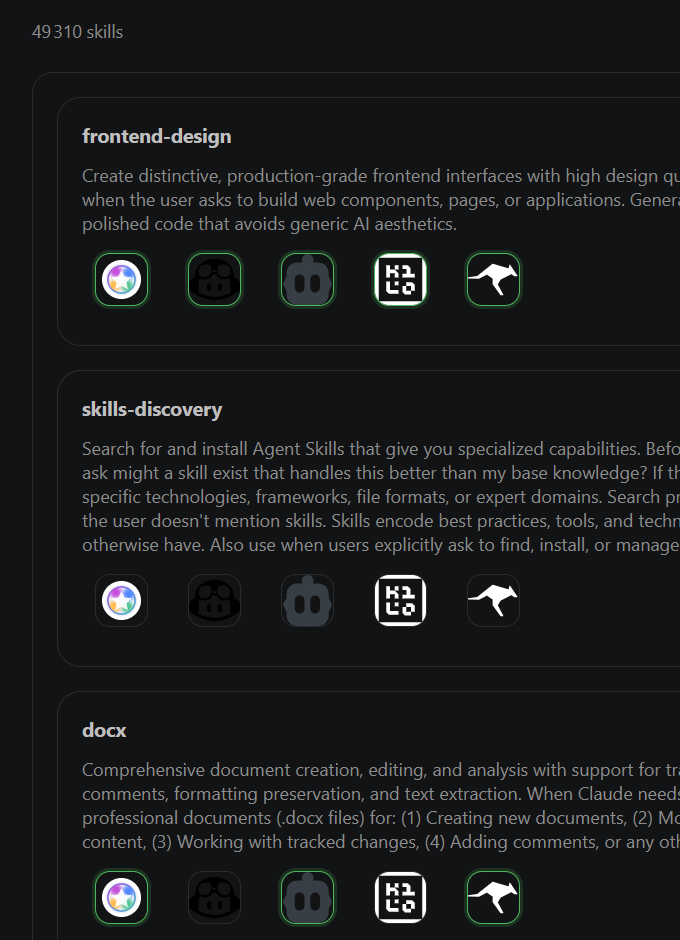

  

# Skills Hub – VS Code Extension

**Manage, visualize, and boost your agents and their skills in VS Code with a modern and intuitive experience.**

---

## 🚀 Why Choose Skills Hub?

- **Elegant Interface**: A sleek design that integrates seamlessly with VS Code.
- **Smart Management**: Add, remove, and organize your agents in just a few clicks.
- **Clear Visualization**: Easily explore each agent's skills.
- **Increased Productivity**: Focus on what matters with fast and intuitive navigation.

---

## ✨ Main Features

- Add and remove agents through a modern interface.
- Instantly view the skills associated with each agent.
- Responsive and pleasant user interface.
- Smooth experience, designed for demanding developers.
- **From the Marketplace, simply click on an agent's icon to install a skill for that agent.**

---

## 📸 Marketplace Example

<table>
  <tr>
    <td width="68%" rowspan="3" valign="top">
      
    </td>
    <td width="32%" valign="middle" style="font-size: 1.03rem; line-height: 1.45; padding: 8px 10px;">
      <strong style="font-size: 1.08rem;">Top card - frontend-design</strong> 
      All agents have this skill.
    </td>
  </tr>
  <tr>
    <td width="32%" valign="middle" style="font-size: 1.03rem; line-height: 1.45; padding: 8px 10px;">
      <strong style="font-size: 1.08rem;">Middle card - skills-discovery (skills_discovery)</strong> 
      No agent has this skill.
    </td>
  </tr>
  <tr>
    <td width="32%" valign="middle" style="font-size: 1.03rem; line-height: 1.45; padding: 8px 10px;">
      <strong style="font-size: 1.08rem;">Bottom card - docx</strong> 
      Only three agents have this skill.
    </td>
  </tr>
</table>

<em>Green highlighted agent icons indicate the skill is installed for that agent.</em>

---

## 🛠️ Installation

1. Download the extension `.vsix` file.
2. In VS Code, open the Extensions menu > ... > Install from VSIX...
3. Select the downloaded file and follow the instructions.

---

## ❓ Need Help?

- Make sure you are using the latest version of VS Code.
- Ensure the `README.md` file is present in the package.
- Check the integrated documentation or open an issue on the repository.

---

  <b>Skills Hub, reinventing agent and skill management for VS Code.</b>

